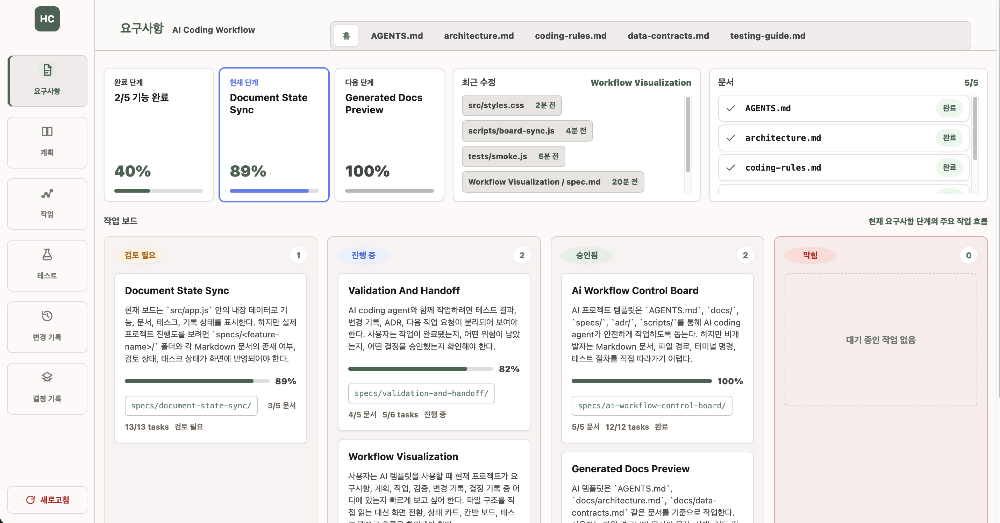
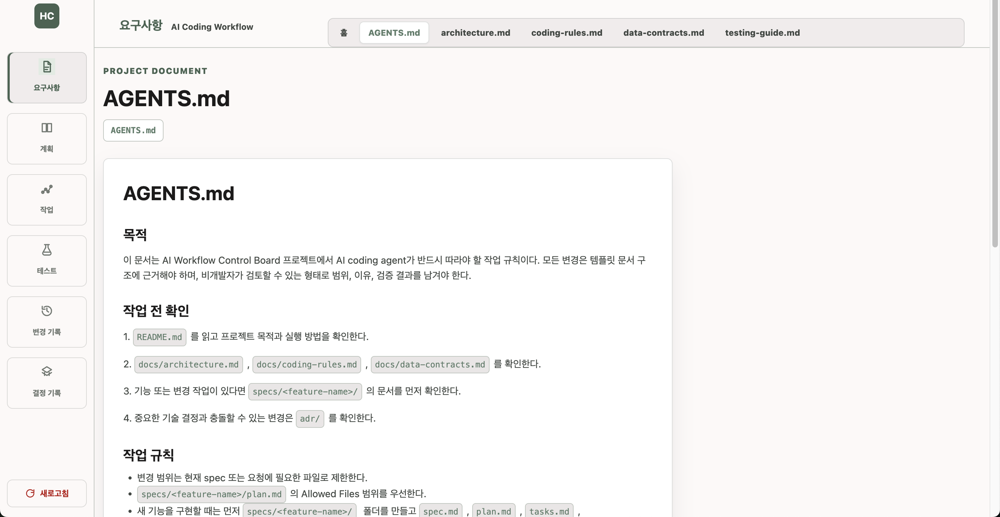
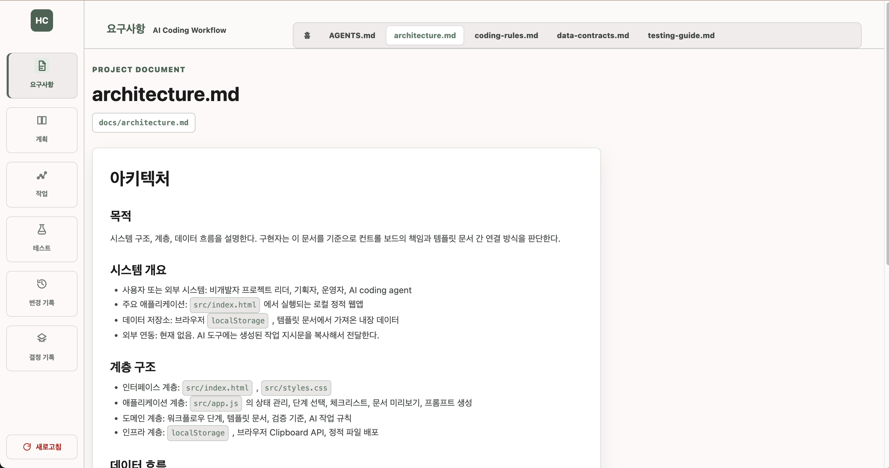
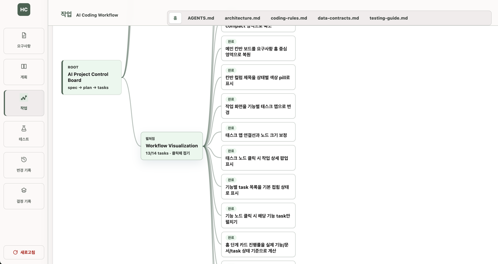
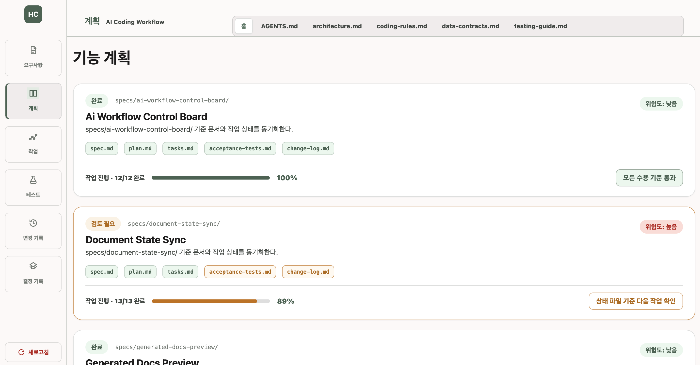
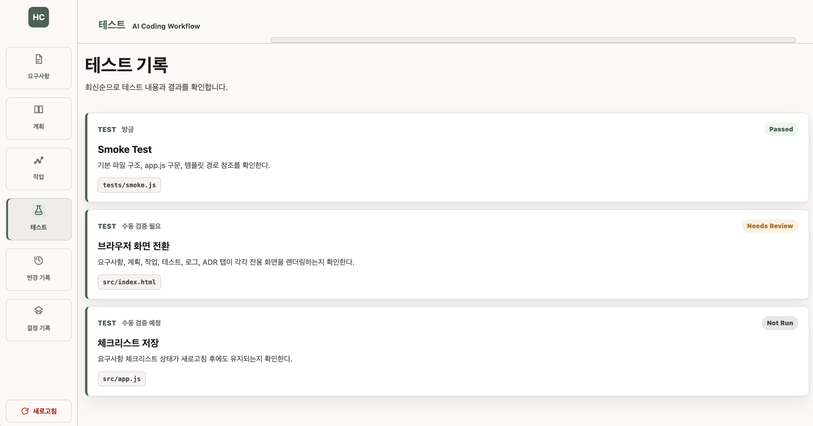
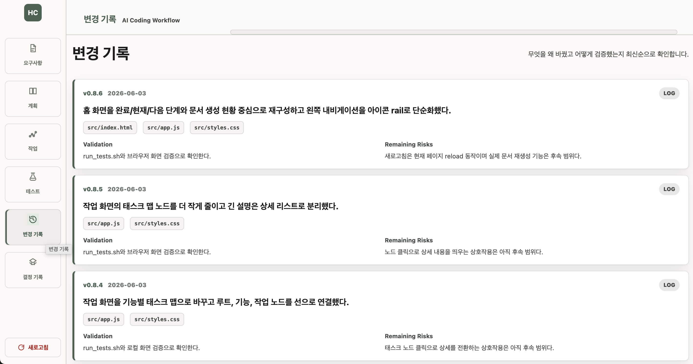
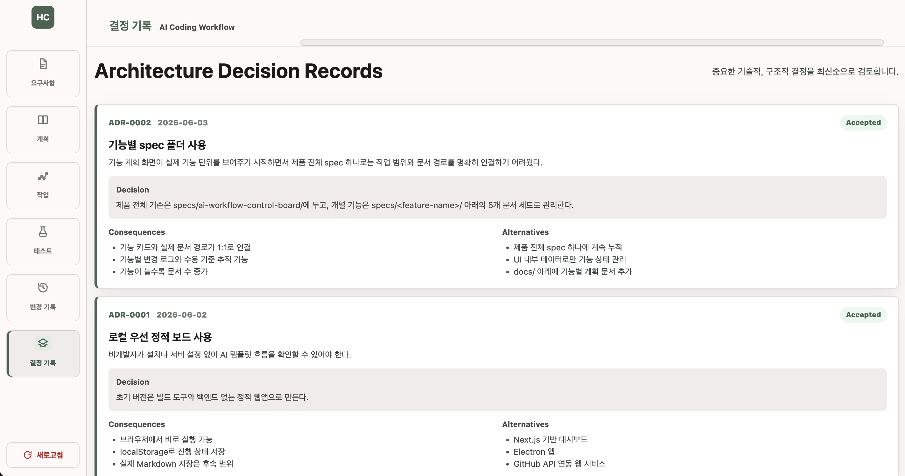

# AI Workflow Control Board

AI Workflow Control Board는 `specs/`, `docs/`, `adr/`, `AGENTS.md`로 구성된 AI 프로젝트 템플릿을 Codex 작업 중 옆에서 확인할 수 있도록 시각화한 로컬 관제판이다.

보드는 실제 Markdown 문서, 기능별 spec 폴더, 작업 상태, 최근 수정 파일을 한 화면에 보여준다. 사용자는 파일 구조를 직접 탐색하지 않아도 Codex가 어떤 기능과 문서를 중심으로 작업하고 있는지 확인할 수 있다.

## 실행

브라우저에서 `src/index.html`을 열거나 로컬 정적 서버로 `src/`를 제공한다.

작업 후 최신 문서 상태를 반영하려면 다음 명령을 실행한다.

```bash
node scripts/board-sync.js
```

## 구조

```text
.
├── AGENTS.md
├── README.md
├── docs/
├── specs/
│   └── ai-workflow-control-board/
├── adr/
├── scripts/
├── src/
│   ├── index.html
│   ├── styles.css
│   └── app.js
└── tests/
```

## 기본 명령

```bash
./scripts/run_tests.sh
```

## 핵심 흐름

```text
프로젝트 기준 확인
  -> 요구사항 작성
  -> 구현 계획 작성
  -> 작업 분해
  -> Codex 작업 진행
  -> 보드 새로고침으로 문서/기능/최근 수정 확인
  -> 테스트와 수동 검증
  -> 변경 로그와 결정 기록
```

## 보드가 보여주는 것

- 핵심 문서: `AGENTS.md`, `docs/architecture.md`, `docs/coding-rules.md`, `docs/data-contracts.md`, `docs/testing-guide.md`
- 기능 상태: `specs/<feature-name>/` 아래의 `spec.md`, `plan.md`, `tasks.md`, `acceptance-tests.md`, `change-log.md`
- 작업 상태: 기능별 `tasks.md` 체크박스 기반 진행률
- 최근 수정: 자동 생성 상태 파일을 제외한 실제 작업 파일 최신순 목록


## Screenshots

### Home Dashboard



### Document Preview





### Task Board



### Feature And Records








