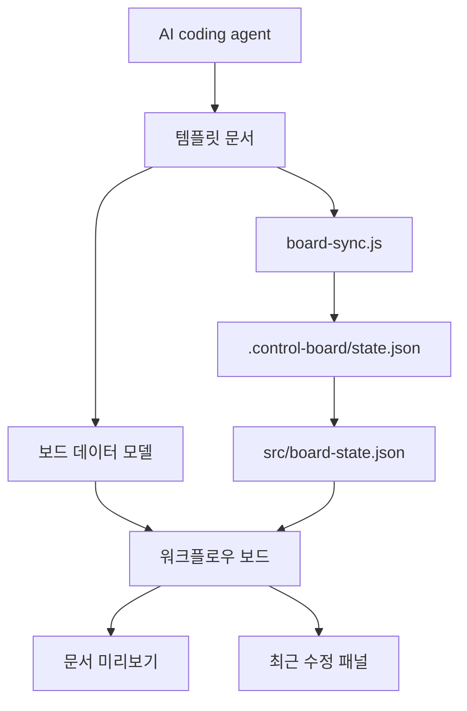

# 아키텍처

## 목적

시스템 구조, 계층, 데이터 흐름을 설명한다. 구현자는 이 문서를 기준으로 컨트롤 보드의 책임과 템플릿 문서 간 연결 방식을 판단한다.

## 시스템 개요

- 사용자 또는 외부 시스템: 비개발자 프로젝트 리더, 기획자, 운영자, AI coding agent
- 주요 애플리케이션: `src/index.html`에서 실행되는 로컬 정적 웹앱
- 데이터 저장소: 브라우저 `localStorage`, `.control-board/state.json`, `src/board-state.json`, 템플릿 문서에서 가져온 fallback 데이터
- 외부 연동: 현재 없음. Codex 작업 후 상태 동기화 파일을 새로고침해 관제판에 반영한다.

## 계층 구조

- 인터페이스 계층: `src/index.html`, `src/styles.css`
- 애플리케이션 계층: `src/app.js`의 상태 파일 로딩, 단계 선택, 문서 미리보기, 기능/작업/최근 수정 렌더링
- 도메인 계층: 워크플로우 단계, 템플릿 문서, 기능 spec, 작업 상태, 최근 수정 상태
- 인프라 계층: `scripts/board-sync.js`, `localStorage`, 정적 파일 배포

## 데이터 흐름

## 의존성 규칙

- 보드 데이터는 실제 템플릿 파일 경로를 함께 보관한다.
- 템플릿 문서의 의미가 바뀌면 보드 카드, 상태 동기화 규칙, 검증 기준을 함께 갱신한다.
- 외부 빌드 도구 없이 실행 가능해야 한다.
- 사용자 입력 저장은 브라우저 로컬 상태에 한정한다.
- `.control-board/state.json`과 `src/board-state.json`은 생성 파일이며 최근 수정 목록의 사용자 관찰 대상에서는 제외한다.

## 열린 질문

- 여러 프로젝트를 동시에 관리하는 저장 형식은 후속 spec에서 정의한다.
